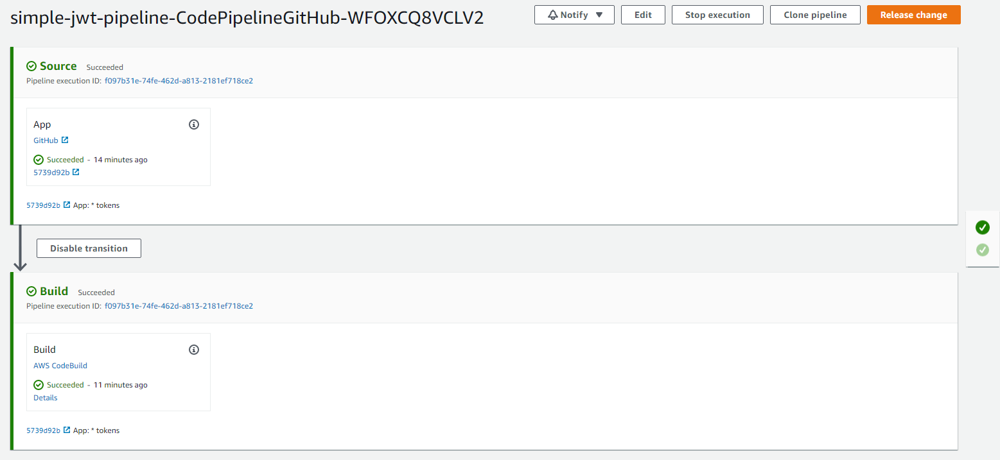

# Deploying a Flask API

This is the project starter repo for the fourth course in the [Udacity Full Stack Nanodegree](https://www.udacity.com/course/full-stack-web-developer-nanodegree--nd004): Server Deployment, Containerization, and Testing.

In this project you will containerize and deploy a Flask API to a Kubernetes cluster using Docker, AWS EKS, CodePipeline, and CodeBuild.

The Flask app that will be used for this project consists of a simple API with three endpoints:

- `GET '/'`: This is a simple health check, which returns the response 'Healthy'. 
- `POST '/auth'`: This takes a email and password as json arguments and returns a JWT based on a custom secret.
- `GET '/contents'`: This requires a valid JWT, and returns the un-encrpyted contents of that token. 

The app relies on a secret set as the environment variable `JWT_SECRET` to produce a JWT. The built-in Flask server is adequate for local development, but not production, so you will be using the production-ready [Gunicorn](https://gunicorn.org/) server when deploying the app.

## AWS Deployment

### 1) Stacks

The build of 3 stacks is successful:
 
 1. CD Pipeline
 2. Worker nodes
 3. EKS cluster

### 2) Worker nodes "EC2 Instances"

### 3) EKS cluster

### 4) CD Pipeline

### 4) First sucessful build

### 5) Build failed

The build fails because one of the unit tests has failed.

### 6) EKS cluster is connected to kubectl

### 7 ) Postman tests 

#### 7.1) POST /auth

#### 7.2) GET /contents

